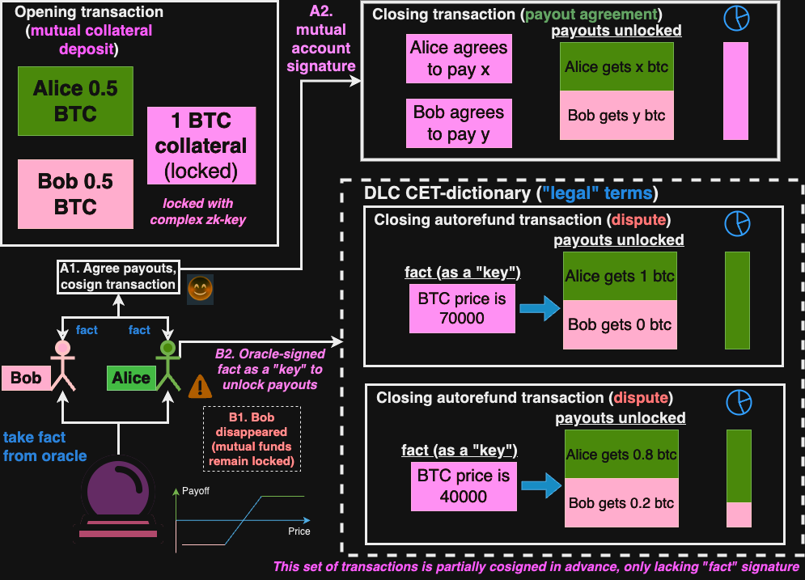

# Wolfram Oracle
Wolfram app-id (use your own, https://products.wolframalpha.com/simple-api/documentation): <input id = "wf-app-id" value="6WU6JX-46EP5U9AGX"></input>
 
Cors proxy prefix (to query wolfram services): <input id = "cors-proxy-prefix" value="https://corsproxy.io/?"></input>

BTC price is: <input id = "ticker"></input> (<input type="checkbox" id="lock" name="lock" >lock</input>)
 
[source: Wolfram Alpha](https://api.wolframalpha.com/v1/result?appid=6WU6JX-46EP5U9AGX&i=1%20btc%20to%20usd%20number)

# Marlowe Contract

Let's generate marlowe European Call contract first. Alice and Bob are betting on BTC price. The risk is amortized for small price changes between Alice's premium at risk and Bob's margin at risk, leveraged by notional. The deal is P2P, thus fully collatrerized, no "pooled margin account" risks involved. 

Cardano version: https://github.com/dk14/marlowe-wolfram-starter-kit/blob/main/22-eurocall.ipynb

Contract terms:

* Contract strike is <input type="number" id="strike" name="quantity" min="1" max="100000" value="30000"></input> usd
* Alice pays premium of <input type="number" id="premium" name="quantity" min="1" max="100000" value="200"></input> usd
* Notional/Leverage is <input type="number" id="notional" name="quantity" min="1" max="100000" value="1"></input> btc
* Bob's margin is <input type="number" id="margin" name="quantity" min="1" max="100000" value="300"></input> usd
* Oracle range is <input type="number" id="minValue" name="quantity" min="1" max="100000" value="29900"></input> to <input type="number" id="maxValue" name="quantity" min="1" max="100000" value="30700"></input>

<button type="button" style="height: 30px" onclick="
    document.querySelector('#marlowe-frame').style = ''; 
    window.api.injectMarloweContract({template: 'eurocall', terms: extractTerms()}); 
    document.querySelector('#sample-btn').disabled=false; 
    document.querySelector('#plot-alpha-btn').hidden=true;
    document.querySelector('#download-csv-btn').hidden=true;
    document.querySelector('#download-nb-btn').hidden=true; 
    document.querySelector('#wolf-plot').innerHTML=''">
Generate Marlowe contract!
</button>
 
 

*Note: this is webarchived slightly edited SNAPSHOT of open source Marlowe Playground, **NOT ACTUAL** PLAYGROUND BY IOHK (see https://replayweb.page/docs/wacz-format, actual Playground might differ: https://play.marlowe.iohk.io/, https://github.com/input-output-hk/marlowe-playground). Do NOT trust this for any other purposes than educational. Generator auto-fills the contract for you (since original playground doesn't support that), so you could simulate the contract. USE actual https://play.marlowe.iohk.io/ for contract development.*

<progress id="sampling-progress" value="0" max="100" style="display:none"></progress>

<iframe src="./marlowe.html" 
title="Marlowe" height="800" width = "100%" id = "marlowe-frame" 
style = "filter: blur(1.5px) grayscale(80%) hue-rotate(30deg) sepia(10%); pointer-events: none" 
frameborder="no">
</iframe>

# Sampling

Let's sample Marlowe contract and plot the payoff curve. 
*Note: contract has to be generated first*

<button type="button" id="sample-btn" style="height: 30px;" disabled onclick="window.api.sampleMarloweContract().then(() => window.api.embedWolfPlot(document.getElementById('wolf-plot')))">Sample Marlowe contract!</button>
 

<button type="button" id="plot-alpha-btn" style="height: 30px;" hidden onclick="window.api.plotMarloweContractAlpha(); ">Plot with Wolfram Alpha</button>
<button type="button" id="download-csv-btn" style="height: 30px;" hidden onclick="window.api.downloadSampledContractAsCsv(); ">Download as CSV</button>
<button type="button" id="download-nb-btn" style="height: 30px;" hidden onclick="window.api.downloadWolfNb(); ">Download as Wolfram Notebook</button>
 

# Prepare Oracle R and s values for Bitcoin DLC
  

Warning: Don't use any of it with actual Bitcoin mainnet - educational purposes only  

Oracle quesion: <input id = "oracle-question" value="What is the price of BTC in USD" size = 80></input>
 
Oracle secret (hex):  <input id = "oracle-secret" value="B7E151628AED2A6ABF7158809CF4F3C762E7160F38B4DA56A784D9045190CFEF" size = 80></input>

Oracle's public key:  
\\(V = secret \circ G\\) 
 

Oracle's secret k-value: 
 
\\( k= hash(secret_{oracle} G || hash(aux) || question) \mod n \\)
  
*(Security note: k-value is derived from hash-encrypted question)*
 

Oracle's public commited R-value:  
\\( R=kG \\)
 
 
*(this value is returned by the oracle API when someone is asking for a question that is not answered yet)*
 

Oracle's future answer:   

Tweaked public key (adaptor point), contract parties derive it from R, possible answer and oracle's public key 
 \\( Pub_{Alice, question} = Pub_{Alice} + s_{answer}G\\),   where \\(s_{answer}G = R − hash(answer || R)V\\)
  

When the answer is ready...  Oracle publishes s-value (signature):   
*(Note: signature is derived from pre-commited k-value, thus R-value part would be commited R-value as well)*
 

This value is gonna be used as a secret (private key corresponding to adaptor public key) to co-sign CET transactions in case of dispute.

# Prepare Transactions for Bitcoin DLC

Original DLC paper: https://adiabat.github.io/dlc.pdf  
DLC and Oracles: https://docs.google.com/document/d/1TVYvpZwwGLrSYHtnpoEoSE1csMSZfZ-A7xF9w0viMIs/edit?usp=sharing  
Decode TX hexes (choose Testnet): https://live.blockcypher.com/btc/decodetx/  

Alice: 
* secret (hex):  <input id = "alice-secret" value="C90FDAA22168C234C4C6628B80DC1CD129024E088A67CC74020BBEA63B14E5C9" size = 80></input>
* utxo value: <input type="number" id="alice-amount-in" name="quantity" min="1" max="100000" value="100"></input>
* txid (hex):  <input id = "alice-tx-id" value="6220e8113cb985b6c9bef8acb43b7573ba7f6b3230f27339d3d357ead51f65cc" size = 80></input>
* vout: <input type="number" id="alice-vout" name="quantity" min="0" max="100" value="0"></input>

Bob:
* secret (hex):  <input id = "bob-secret" value="C90FDAA22168C234C4C6628B80DC1CD129024E088A67CC74020BBEA63B14E5C7" size = 80></input>
* utxo value: <input type="number" id="bob-amount-in" name="quantity" min="1" max="100000" value="100"></input>
* txid (hex):  <input id = "bob-tx-id" value="6220e8113cb985b6c9bef8acb43b7573ba7f6b3230f27339d3d357ead51f65cc" size = 80></input>
* vout: <input type="number" id="bob-vout" name="quantity" min="0" max="100" value="1"></input>
----
\\(OpeningTx: txin_{AliceCollateral}(Pub_{Alice}) + txin_{BobCollateral}(Pub_{Bob}) = txout_{JointCollateral}(Pub_{Alice} + Pub_{Bob})\\)   
**Opening TxId:**   
**Opening Hex:**   

----
\\(ClosingTx: txin_{JointCollateral}(Pub_{Alice} + Pub_{Bob}) = txout_{AlicePayoff}(Pub_{Alice}) + txout_{BobPayoff}(Pub_{Bob})\\)   
**Closing TxId:**   
**Closing Hex:**   

----
\\(DisputeTx: txin_{JointCollateral}(Pub_{Alice} + Pub_{Bob}) = txout_{AlicePayoff}(Pub_{Alice} + s_{answer}G) + txout_{BobPayoff}(Pub_{Bob})\\)  
\\(s_{answer}G\\) is known in advance, while \\(s_{answer}\\) will be published by Oracle   

**Dispute CET TxId:**   
**Dispute CET Hex:**   

----
\\(RedemptionTx: txin_{AlicePayoff}(Pub_{Alice} + s_{answer}G) = txout_{AlicePayoff}(Pub_{Alice}) \\)  
\\(signature = (s_{Alice} + s_{answer}) || (R_{Alice} + R_{question})\\)
  

**Dispute Redemption TxId:**   
**Dispute Redemption Hex:**   

----
 

